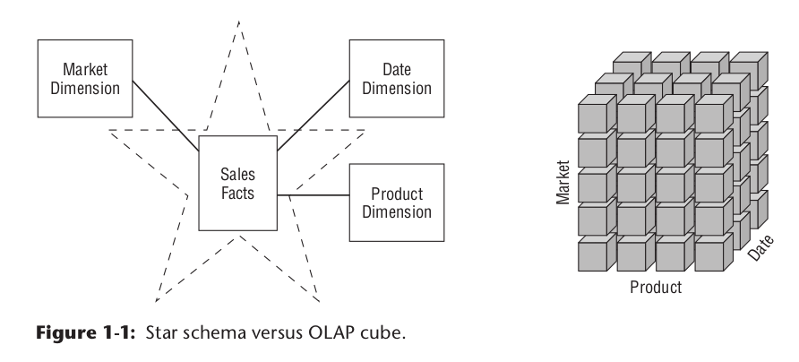
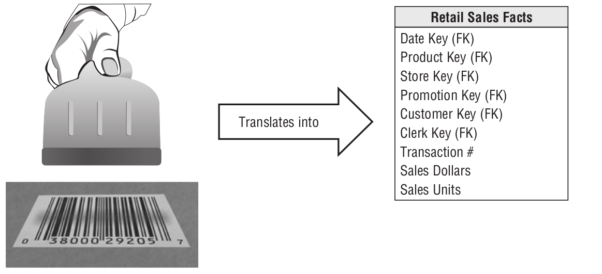
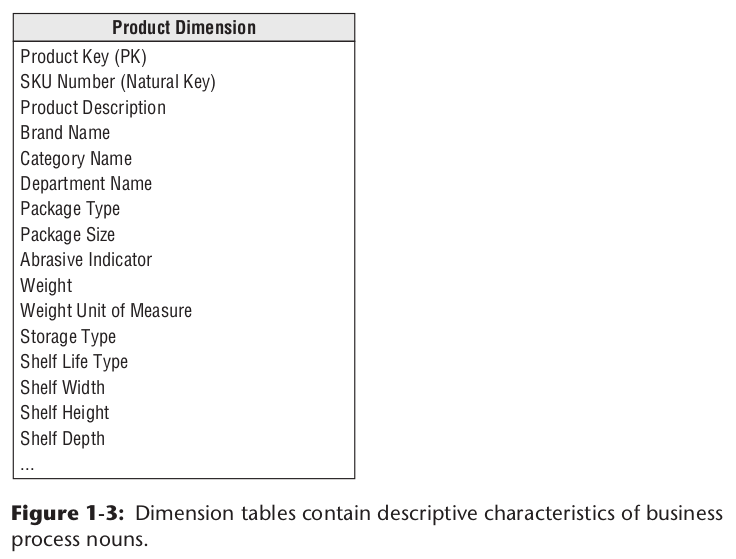
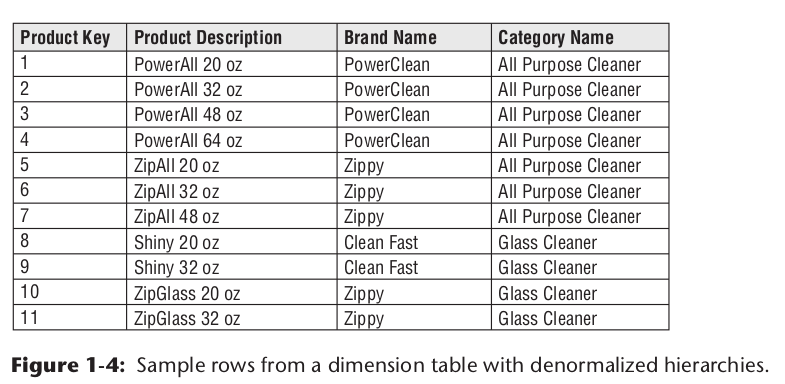
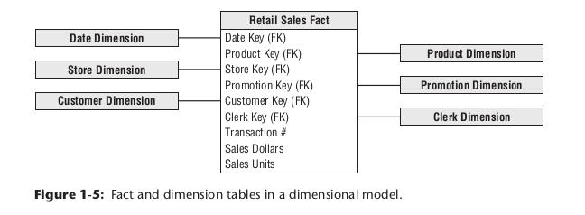
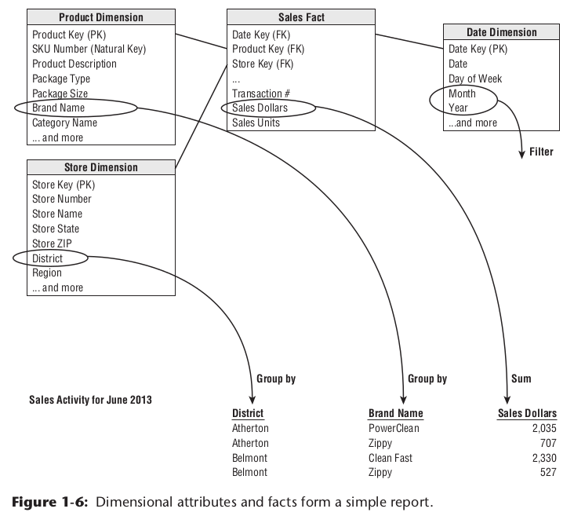

# 📘 Chapter 1: Foundations of a Data Warehouse (DW)

## 🎯 Key Topics

| Area | Description |
| --- | --- |
| 🎯 Business Goals | Understanding how DW supports strategic decisions |
| 📢 DW Publishing | Delivering data to users in accessible formats |
| 🧱 Major Components | Core elements that make up a DW architecture |
| 🧭 Dimensional Modeling | Essential for effective data presentation |
| 📊 Fact & Dimension Tables | Key building blocks of DW schemas |
| ❌ Dimensional Modeling Myths | Common misconceptions to debunk |
| ⚠️ Common Pitfalls | Mistakes to avoid when designing a DW |

---

## 🧠 The Core Asset: Information

Information is the most valuable asset in an organization and is handled in two primary systems:

### 🔄 Operational Systems of Record

| Feature | Description |
| --- | --- |
| 📥 Data Flow | Focused on data being put in |
| 🔁 Usage Pattern | Users interact with one record at a time |
| 🛠️ Purpose | Supports repetitive operational tasks |

### 📤 Data Warehouse (DW)

| Feature | Description |
| --- | --- |
| 📤 Data Flow | Designed to get data out |
| 📊 Usage Pattern | Queries return sets of rows, not single records |
| ❓ Usage Style | Users constantly change the questions they ask |

## ⚖️ Key Difference

> There is a strong dichotomy between operational systems and data warehouses.
> 

🔍 DWs are built to support analysis and decision-making — fundamentally different from the task-oriented nature of operational systems.

🚫 However, many so-called DWs are just operational system replicas on separate hardware — a critical design flaw.

## 🎯 Goals of a Data Warehouse

### 💬 Common Business Pains

> These recurring business frustrations shape the essential requirements for a data warehouse:
> 

🗣️ Real-world quotes from business stakeholders:

- “We have mountains of data in this company, but we can’t access it.”
- “We need to slice and dice the data every which way.”
- “You’ve got to make it easy for business people to get at the data directly.”
- “Just show me what is important.”
- “It drives me crazy to have two people present the same business metrics at a meeting, but with different numbers.”
- “We want people to use information to support more fact-based decision making.”

### ✅ Translating Needs into DW Requirements

| 🎯 Goal | 📝 Description |
| --- | --- |
| 📂 Easy Accessibility | Information must be understandable, intuitive, and quickly retrievable.  ⏱️ Minimal wait time for query results.  🔎 Understandable = Legible & clear to business users. |
| 📏 Consistency | Must present information in a credible, high-quality, and condensed form.  🧼 Released only when fit for consumption. |
| 🔄 Adaptability | The DW should gracefully handle change.  🔒 Changes must not break existing data or systems. |
| 🛡️ Security | Acts as a protective bastion for the organization's information.  🚫 Controls access to sensitive or confidential data. |
| 🧠 Decision Support | The DW's core purpose is to enable better, fact-based decision-making.  ✅ Only one true output: business insight. |
| 👥 User Adoption | A DW is only successful if embraced by the business community.  📅 If it’s not used six months after rollout, the project has failed the adoption test. |

## 🧾 Comparing a DW Manager to an Editor-in-Chief

Being a Data Warehouse (DW) Manager is much like being the editor-in-chief of a magazine. Both roles center around delivering quality content to the right audience.

### 🧑‍💼 What a Magazine Editor Does

| Task | Description |
| --- | --- |
| 👥 Understand Readers | Identify your audience demographically |
| 📚 Tailor Content | Learn what your readers want from the magazine |
| 🌟 Focus on Value | Identify top readers—those who renew and engage |
| 📣 Grow Readership | Attract new readers and increase awareness |

### 📊 What a DW Manager Does

> A DW Manager is a publisher of the right data.
> 

| Responsibility | Description |
| --- | --- |
| 🧭 Be Business-Driven | Understand what data the business needs |
| 🧹 Ensure Quality | Gather data from many sources and clean it for consistency |
| 🏗️ Curate & Publish | Prepare and publish data so it’s ready for consumption |
| 🚀 Support, Not Showcase, Technology | Technology is just the delivery mechanism—never the main focus |

📌 Your role is not to highlight tech or tools, but to deliver meaningful, reliable, and actionable data—driven by business needs.

### 🎯 Why Use Dimensional Modeling?

| Requirement | Benefit |
| --- | --- |
| 👥 Business-Friendly | Models are understandable and intuitive for business users |
| ⚡ Fast Performance | Delivers superior query performance, especially for BI workloads |

🧩 Normalized (3NF) schemas are great for operational systems, but too complex for business users and too inefficient for analytical queries.

> ✅ Dimensional models contain the same information as normalized models—but optimized for readability, speed, and adaptability.
> 

## 🌟 Star Schemas vs. 🧊 OLAP Cubes

| Feature | Star Schema | OLAP Cube |
| --- | --- | --- |
| 📚 Type | Relational (RDBMS) | Multidimensional (OLAP) |
| 🧠 Concept | Based on dimensions and facts | Also based on dimensions and facts |
| 💡 Logical Design | Same across both | Same core structure |
| 🧮 Physical Storage | Tables (RDBMS) | Specialized multidimensional formats |
| 🚀 Query Speed | Fast | Extremely fast |
| 🔧 Functionality | Standard SQL | Richer analytical capabilities |
| 🕒 Load Performance | Faster loads | Slower with large datasets |



📝 Recommendation:

- Load atomic (detailed) data into a star schema first.
- Build optional OLAP cubes from the star schema for advanced analysis.

## ⚙️ OLAP Deployment Considerations

Although the capabilities of OLAP technology are continuously improving, we generally recommend that detailed, atomic information be loaded into a star schema; optional OLAP cubes are then populated from the star schema.

| # | Consideration |
| --- | --- |
| 1️⃣ | Star schemas in RDBMS are a solid foundation for OLAP cubes |
| 2️⃣ | OLAP cubes offer fast performance, though RDBMS performance is catching up thanks to in-memory and columnar DBs |
| 3️⃣ | OLAP tools vary more between vendors than relational databases, making BI migration harder |
| 4️⃣ | OLAP cubes typically offer more advanced security features |
| 5️⃣ | OLAP provides richer, more complex analytical functions than standard SQL |
| 6️⃣ | OLAP cubes handle slowly changing dimension (SCD) type 2 well, but reprocessing may be needed for other SCD types |
| 7️⃣ | Supports transaction and periodic snapshot fact tables well, but not accumulating snapshots |
| 8️⃣ | Natively supports complex, ragged hierarchies (e.g., org charts, BOMs) better than RDBMSs |
| 9️⃣ | Some OLAP tools lack dimension aliasing, requiring duplicate dimensions |

## 📊 Fact Tables: The Core of Measurements

A fact represents a measurable business event.

> 🧾 Imagine observing a sales counter and recording each transaction’s quantity and dollar amount — that’s a fact in action.
> 

**Each fact table row corresponds to a single event in the real world, such as a sale or an order — a cornerstone concept in dimensional modeling.**



### **🧮 Types of Facts**

| Type            | Description                                                                 | Example                | Additivity      |
|-----------------|-----------------------------------------------------------------------------|------------------------|-----------------|
| Additive        | Can be summed across all dimensions                                         | Sales Amount           | Fully additive  |
| Semi-additive   | Can be summed across some, but not all, dimensions (often not across time)  | Account Balance        | Semi-additive   |
| Non-additive    | Cannot be summed across any dimension                                       | Unit Price             | Non-additive    |

- **Additivity is crucial** because BI tools often aggregate large numbers of fact rows.
- **Textual facts** are rare and usually should be stored in dimension tables unless they are unique per event.

### **🧩 Fact Table Structure**

| Component         | Emoji | Description                                                                                   |
|-------------------|:-----:|-----------------------------------------------------------------------------------------------|
| Foreign Keys      | 🔑    | Link to dimension tables (e.g., Product_ID, Date_ID, Store_ID)                                 |
| Facts/Measures    | 📏    | Numeric business metrics (e.g., Sales_Amount, Quantity)                                       |
| Composite Key     | 🧷    | Uniquely identifies each row, often a combination of foreign keys                             |
| Audit Attributes  | 📝    | Metadata for data lineage and quality (e.g., created date, last modified by)                  |

**Example:**

| **Sale_ID** | **Date_ID** | **Product_ID** | **Store_ID** | **Sale_Amount** |
| --- | --- | --- | --- | --- |
| 1 | 101 | 201 | 301 | 50.00 |
| 2 | 102 | 202 | 302 | 30.00 |

## **🔗 Referential Integrity**

- **Fact tables** reference dimension tables via foreign keys.
- **Referential integrity** ensures every foreign key in the fact table matches a primary key in a dimension table.
- Access to facts is always through joins to dimensions.

## **📏 Fact Table Grain**

- **Grain** defines the level of detail (e.g., one row per sales transaction).
- Each row should represent a single, atomic measurement event.

## **📦 Fact Table Types**

| Type                      | Emoji | Description                                                                                           | Example                        |
|---------------------------|:-----:|-------------------------------------------------------------------------------------------------------|--------------------------------|
| Transaction Fact Table    | 🧾    | Records individual events at the lowest possible granularity                                           | Sales transactions             |
| Periodic Snapshot Table   | 📅    | Captures measurements at regular intervals (e.g., daily, monthly)                                     | Daily inventory levels         |
| Accumulating Snapshot     | 📈    | Tracks progress of a process through multiple stages/milestones                                       | Order fulfillment process      |

## **🚫 What Not to Do**

- **Do not fill fact tables with zeros** to represent no activity-only record actual events. This keeps tables sparse and efficient.
- **Avoid storing redundant textual data** in fact tables. Use dimensions for descriptions unless the text is unique per event.

### 🧵 Example: Textual Fact (Rare Case)

Let's say we have a fact table called "Sales_Fact" with dimensions like "Product," "Customer," and "Time." One of the columns in the fact table could be a textual fact, such as "Sales_Description," which contains a textual description or note associated with each sale.

| Sales_ID | Product_ID | Customer_ID | Time_ID | Sales_Amount | Sales_Description |
| --- | --- | --- | --- | --- | --- |
| 1 | 101 | 1001 | 20240501 | 50.00 | "Customer bought a shirt and jeans" |
| 2 | 102 | 1002 | 20240502 | 30.00 | "Customer purchased two books" |

- **Date_ID, Product_ID, Store_ID**: Foreign keys to dimension tables
- **Sale_Amount**: Additive fact
- **Sales_Description**: Rare textual fact (use sparingly)

### **📏 Fact Table Characteristics**

- **Deep, not wide:** Many rows, relatively few columns.
- **Consumes most storage:** Often 90%+ of dimensional model space.
- **Composite key:** Usually made up of foreign keys.
- **Many-to-many relationships:** Each fact links to multiple dimensions.


### **🛠️ Fact Table Design Best Practices**

- Store only true activity (no zero rows).
- Use numeric, additive facts whenever possible.
- Maintain referential integrity with dimension tables.
- Clearly define the grain before designing.
- Use composite keys for uniqueness.
- Only include textual facts when absolutely necessary.

### **🌟 Quick Reference Table: Fact Table Essentials**

| Feature                | Emoji | Why It Matters                                         |
|------------------------|:-----:|--------------------------------------------------------|
| Additive Facts         | ➕    | Enable fast, flexible aggregation                      |
| Foreign Keys           | 🔑    | Connect facts to descriptive context                   |
| Sparse Rows            | 🏜️    | Efficient storage; only real events recorded           |
| Defined Grain          | 🎯    | Ensures clarity and consistency in analysis            |
| Referential Integrity  | 🧩    | Guarantees data quality and meaningful joins           |

### **💡 Pro Tip**

> **Fact tables are the quantitative heart of dimensional modeling-design them to be efficient, additive, and tightly linked to descriptive dimensions for powerful analytics.**

## 🧭 Dimension Tables: Descriptive Context for Facts

Dimension tables provide the rich, textual context for business measurements. They answer the “who, what, when, where, how, and why” behind every fact.

> 📌 Fact tables capture the events. Dimension tables explain them.
> 



### 🧱 Key Characteristics

| Feature | Description |
| --- | --- |
| 📌 Primary Key | Uniquely identifies each row (used in foreign key joins to fact tables) |
| 📐 Few Rows, Many Columns | Tend to be short (thousands of rows) but wide (50–100+ columns) |
| 🗣️ Text-Heavy | Contain verbose textual descriptions (not just codes) |
| 🧠 Semantic Layer | Enable filtering, grouping, and labeling in queries and reports |

### 📊 Example: Product Dimension

| Product_ID | Product_Name | Brand | Category | Size | Color |
| --- | --- | --- | --- | --- | --- |
| 201 | Cotton Shirt | H&M | Apparel | M | Blue |
| 202 | Running Shoes | Nike | Footwear | 42 | Black |

> 🔍 These attributes support reporting “by Brand,” “by Category,” or “by Color.”
> 

### 🎯 Role of Dimension Attributes

Dimension attributes are the backbone of usability in a BI system:

- 🧭 Serve as filter conditions and slicing labels (e.g., "sales by region")
- 📝 Provide human-readable context for reports and dashboards
- 💡 Help users interpret trends and insights
- ✅ Enable flexible and fast analytic exploration

> ✅ Use full words over cryptic codes
> 
> 
> ✅ Avoid unnecessary abbreviations
> 
> ❌ Don’t rely on technical metadata for business users
> 

### ❓ Fact or Dimension? A Classification Test

| Question | Indicates |
| --- | --- |
| Is it used in calculations? | 🧮 Fact |
| Does it represent a measurement with many values? | 🧮 Fact |
| Is it a descriptive label used to filter or group data? | 🗂️ Dimension |
| Does it take values from a small, fixed list? | 🗂️ Dimension |

> Example: Standard Product Cost
> 
> - If it changes frequently → treat as a fact
> - If it is relatively stable → treat as a dimension attribute

🧠 Some data elements can be modeled both ways for flexibility.

### 🏗️ Hierarchies & Denormalization

Dimension tables often contain built-in hierarchies:

| Product → Brand → Category |

- 📦 Product dimension includes brand and category
- 🔁 Hierarchical info is stored redundantly for usability
- ❌ Do not normalize into separate Brand or Category tables

> This flattening avoids complex joins and supports faster queries.
> 

📌 This practice avoids a snowflake schema, favoring denormalized star schemas for simplicity and performance.


### ⚖️ Why Avoid Snowflaking?

| Star Schema (Preferred) | Snowflake Schema (Avoid) |
| --- | --- |
| Denormalized, flat dimensions | Normalized sub-dimensions |
| Fewer joins, easier queries | More joins, more complex queries |
| More readable and usable for business | Optimized for storage, not usability |

> 🧠 Trade disk space for simplicity — dimension tables are small compared to fact tables.
>



## 🌟 Facts and Dimensions in a Star Schema

A **star schema** is a simple, symmetrical design used in data warehousing to represent business processes. It consists of:

- **Fact Table**: Stores numeric measurements (facts) about events.
- **Dimension Tables**: Surround the fact table, providing descriptive context (textual attributes) relevant at the time the event occurred.



### ✨ Key Features

| Feature                           | Description                                                                 |
|------------------------------------|-----------------------------------------------------------------------------|
| **Simplicity & Symmetry**          | Easy to understand, design, and query.                                      |
| **Performance**                    | Fewer joins = faster queries; database optimizers handle these schemas well. |
| **Extensibility**                  | Add new dimensions or facts without disrupting existing structure.           |
| **Flexibility**                    | Dimension tables can grow with new attributes or rows as business evolves.   |

### 🛠️ Schema Modification Options

| Modification Type                | How It Works                                                                 |
|----------------------------------|------------------------------------------------------------------------------|
| Add New Dimension                | As long as each fact row gets a single value for the new dimension.           |
| Add New Fact                     | Must match the existing level of detail in the fact table.                    |
| Add Attributes to Dimensions     | Simply add new columns to dimension tables.                                   |
| Add Data to Existing Tables      | Insert new rows or use SQL `ALTER TABLE` for structure changes.               |

### 📊 Facts & Dimensions in Reporting

- **Dimension Attributes**: Used as filters and labels (e.g., store district, product brand).
- **Fact Values**: Provide the numeric results (e.g., sales dollars).

#### Example SQL Query
```sql
SELECT
    store.district_name,
    product.brand,
    SUM(sales_facts.sales_dollars) AS "Sales Dollars"
FROM
    store,
    product,
    date,
    sales_facts
WHERE
    date.month_name = "January" AND
    date.year = 2013 AND
    store.store_key = sales_facts.store_key AND
    product.product_key = sales_facts.product_key AND
    date.date_key = sales_facts.date_key
GROUP BY
    store.district_name,
    product.brand
```
## 🏢 Components of a Data Warehouse

A modern data warehouse is structured into four main components, each with a distinct role in the data lifecycle:

| Component                | Purpose                                                                                   |
|--------------------------|-------------------------------------------------------------------------------------------|
| Operational Source Systems| Capture business transactions (outside the warehouse)                                     |
| Data Staging Area        | Temporary storage & transformation (ETL)                                                  |
| Data Presentation Area   | Organized, query-ready data for users (integrated data marts)                             |
| Data Access Tools        | Interface for querying, reporting, and analytics                                          |



### 1️⃣ Operational Source Systems

- **Role:** Capture and process business transactions.
- **Characteristics:**
  - Exist *outside* the data warehouse.
  - Content and format are typically beyond the warehouse team's control.
  - Focus on high performance and availability.
  - Store minimal historical data.
  - Offload historical data management to the data warehouse.

### 2️⃣ Data Staging Area (ETL Kitchen 👨‍🍳)

- **Role:** Prepare raw data for the warehouse through ETL (Extract, Transform, Load).
- **Features:**
  - Not accessible to business users.
  - Handles data extraction, cleansing, transformation, deduplication, and key assignment.
  - Often uses flat files, not always relational databases.
  - Dominated by sorting and sequential processing.

| ETL Step     | Description                                                                                      |
|--------------|--------------------------------------------------------------------------------------------------|
| Extract      | Read and copy data from source systems into staging for further processing.                       |
| Transform    | Cleanse, reformat, deduplicate, and merge data to match warehouse requirements.                   |
| Load         | Move quality-assured data into the warehouse/data marts, index, and publish for user access.      |

> *The staging area is like a restaurant kitchen: only skilled professionals are allowed, and users never see the "cooking" process.*

### 3️⃣ Data Presentation Area (Integrated Data Marts)

- **Role:** Store and organize data for direct access by users, report writers, and analytical apps.
- **Features:**
  - The "face" of the warehouse for the business community.
  - Organized as integrated data marts, often by business process.
  - Uses dimensional schemas (star/snowflake) for user-friendly access.
  - Must store detailed (atomic) data, not just summaries, to support flexible ad hoc analysis.

| Feature                | Description                                                                 |
|------------------------|-----------------------------------------------------------------------------|
| User Access            | Direct querying via BI/reporting tools                                       |
| Data Structure         | Dimensional models (star/snowflake)                                          |
| Data Granularity       | Atomic (detailed) data is mandatory                                          |
| Flexibility            | Supports unpredictable, ad hoc queries                                       |

### 4️⃣ Data Access Tools 🛠️

- **Role:** Provide interfaces for users to query, analyze, and visualize data.
- **Examples:** SQL clients, BI dashboards, reporting tools.

### 📝 Summary Table

| Component                | Key Role                        | User Access      | Example Activities                       |
|--------------------------|----------------------------------|------------------|------------------------------------------|
| Operational Source Systems| Capture transactions            | No               | Order entry, billing, CRM                |
| Data Staging Area        | ETL processing                   | No               | Data cleansing, transformation, loading  |
| Data Presentation Area   | Query-ready storage              | Yes              | Reporting, analytics, dashboards         |
| Data Access Tools        | Data interaction & visualization | Yes              | Ad hoc queries, data exploration         |

> **Tip:** The separation of these components ensures scalability, data quality, and performance in delivering business insights.

## 🧩 Dimensional Modeling Myths

Dimensional modeling is a powerful approach for data warehousing, but several persistent myths can lead to poor design and missed opportunities. Here’s a concise breakdown of the most common myths-along with the facts that debunk them.

### 🚫 Myth 1: Dimensional Models are Only for Summary Data

- **Reality:**  
  Dimensional models should always include the most detailed, granular data. This enables users to answer unpredictable business questions by rolling up or drilling down as needed. Summary data can be added for performance, but should never replace detailed data.

| ❌ Myth         | ✅ Fact                                                                 |
|----------------|--------------------------------------------------------------------------|
| Only summary   | Store detailed (atomic) data; summary is just for faster common queries. |

### 🚫 Myth 2: Dimensional Models are Departmental, Not Enterprise

- **Reality:**  
  Dimensional models are best organized around business processes (e.g., orders, invoices), not organizational departments. This supports consistent, enterprise-wide analytics and avoids redundant, inconsistent data marts.

| ❌ Myth         | ✅ Fact                                                                 |
|----------------|--------------------------------------------------------------------------|
| Departmental   | Organize by business process for enterprise integration and consistency.  |

### 🚫 Myth 3: Dimensional Models are Not Scalable

- **Reality:**  
  Dimensional models are highly scalable-fact tables with billions or even trillions of rows are common. Modern database technology is optimized for these structures, ensuring performance at scale[1][3].

| ❌ Myth         | ✅ Fact                                                                 |
|----------------|--------------------------------------------------------------------------|
| Not scalable   | Fact tables can handle billions/trillions of rows with high performance.  |

### 🚫 Myth 4: Dimensional Models are Only for Predictable Usage

- **Reality:**  
  Dimensional models should be designed around stable measurement events, not predefined reports. Their flexibility comes from storing data at the lowest level of detail, supporting both current and future, unpredictable analytic needs[1][3][8].

| ❌ Myth         | ✅ Fact                                                                 |
|----------------|--------------------------------------------------------------------------|
| Only for static reports | Design for detailed, stable measurement events; supports ad hoc and evolving queries. |

### 🚫 Myth 5: Dimensional Models Can’t Be Integrated

- **Reality:**  
  Dimensional models can be fully integrated across the enterprise by using conformed dimensions-centralized, standardized definitions reused across models. This ensures semantic consistency and enables seamless data integration[1][3][7].

| ❌ Myth         | ✅ Fact                                                                 |
|----------------|--------------------------------------------------------------------------|
| Can't integrate| Use conformed dimensions for enterprise-wide integration and consistency. |

### 🎯 Key Takeaways

- **Always store detailed data** for maximum flexibility.
- **Organize by business process** for consistency and integration.
- **Leverage modern DBMS** for scalability.
- **Design for change** and unpredictable queries.
- **Integrate using conformed dimensions** for a unified enterprise view.
